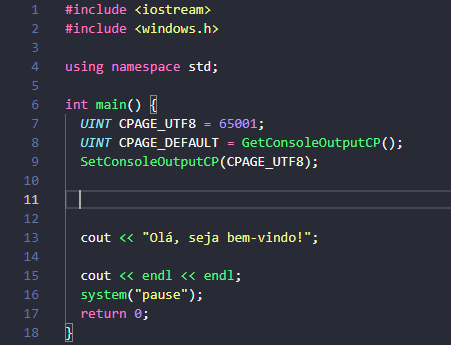

# <h1 align="center"> C++ Basic Structure </h1>

## This is a simple extension for you to start your project in C++ with the printing of special characters in Visual Studio Code.

 

You can save time on your studies by ensuring your code output looks better.

 

 

* To use it's simple: create a new cpp file and type the `cpp` snippet to insert the structure.
* Now you can compile to Visual Studio Code terminal and special characters will appear normally.

## For more information

* [Visit our page on github](https://github.com/edutrindade/cpp--basic-structure)

 **Enjoy!**
